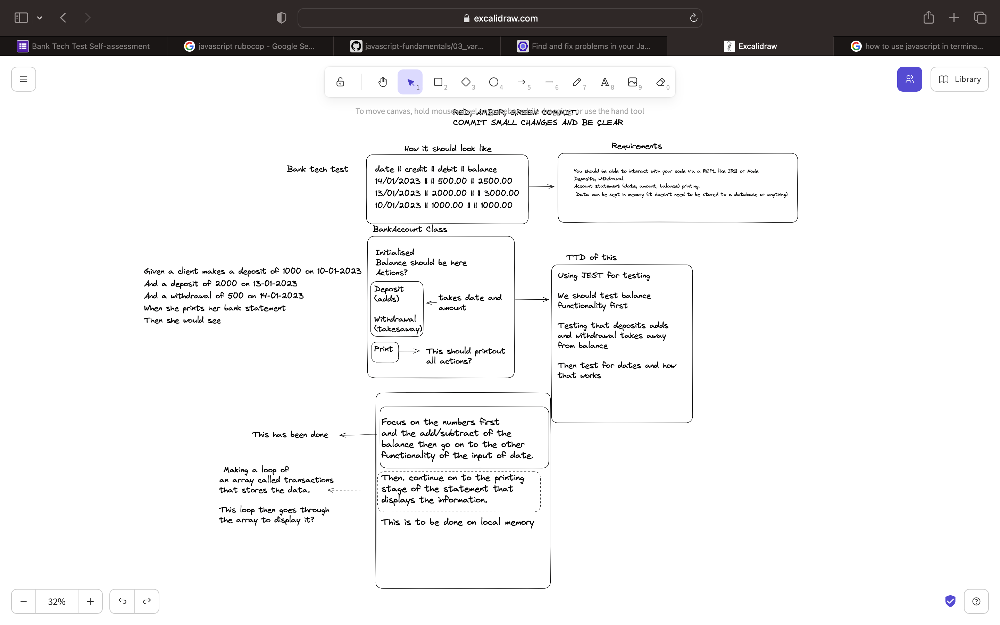
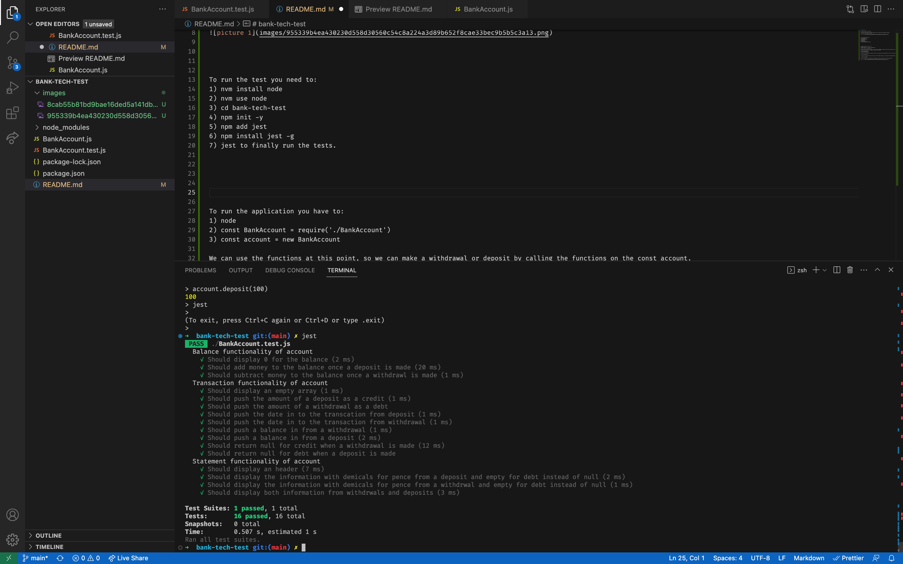
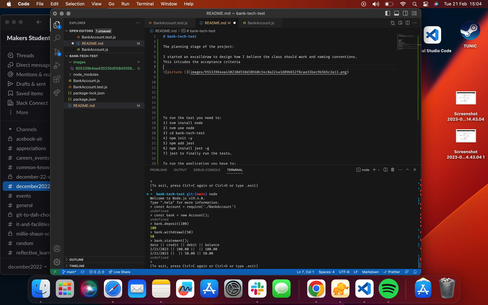

# bank-tech-test

The planning stage of the project:

I started an excaildraw to design how I believe the class should work and naming conventions.
This inlcudes the acceptance criteria

  

To run the test you need to:
1) nvm install node
2) nvm use node
3) cd bank-tech-test
4) npm init -y
5) npm add jest
6) npm install jest -g
7) jest to finally run the tests.

The image below is the test passing in jest

  

To run the application you have to:
1) node
2) const BankAccount = require('./BankAccount')
3) const account = new BankAccount

We can use the functions at this point, so we can make a withdrawal or deposit by calling the functions on the const account.
Withdrawal and Deposit takes in number variables for the account. 

4) account.deposit(100);
5) account.withdrawal(20);

We can just see the balance by using this function, which should use the stored memory in this case to return 80.

6) account.getBalance();

If we want a more detailed history then we can use the statement function to outline what's been deposited and the balances at the time.

7) account.statement();

Here is the application running within the commmand line using local memory to store the information

  
